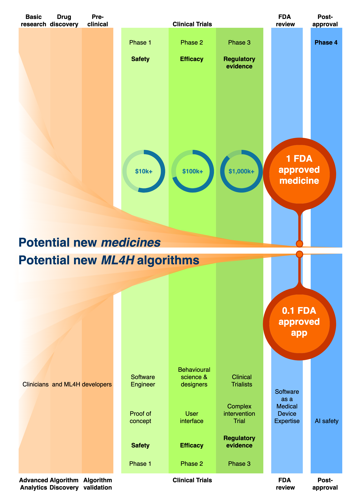
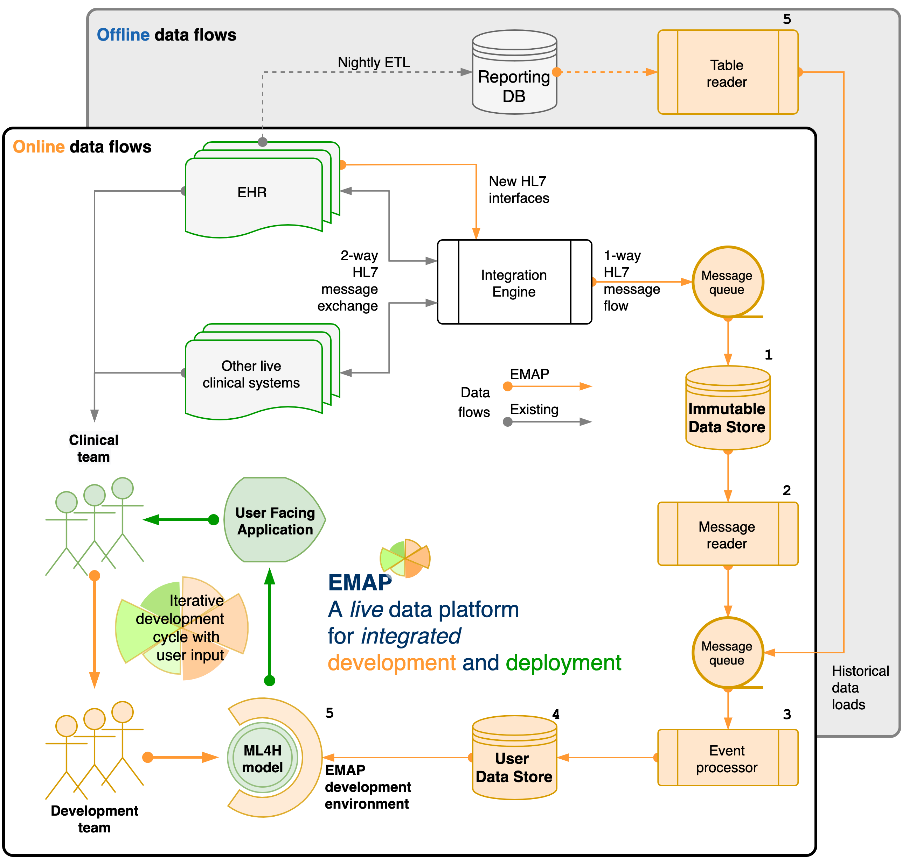

::: keywords
Electronic Health Records, Translational Medicine, Software Engineering, HL7, SQL
:::

# Introduction {#sec:intro}

Machine learning for Health (ML4H) has been expected to impact patient outcomes through diagnostic insights, personalised treatment recommendations, and organisational optimisation.[@yu2018; @topol2019a] Yet there are only a handful of examples of algorithms crossing the : [@keane2018a]\
This *code to bedside* journey is classically separated into development and deployment stages.

## Development versus Deployment

### Development

The development process is *offline*. An algorithm is developed against a static data extract from the reporting database downstream from the live Electronic Health Record (EHR). Consider a simple supervised learning scenario, code is written to 'tidy' the data, to generate labels and features, and to split the extract into train/validate/test subsets. An iterative process then ensues as different modelling approaches are investigated, the labels are refined, and features are updated, added or removed. Eventually, the final best model will be chosen for academic publication, and a handful will transition to deployment.

### Deployment

The deployment process is *online*. The algorithm must be instantiated against data resources with sufficiently low latency to support inpatient clinical or operational decision making. This typically requires an all-together different data pipeline from the development workflow above, as the ETL processes used to populate the reporting database (the source of static data extracts) can rarely be made live. Instead custom data feeds must be prepared directly from the EHR for each feature of the algorithm.[@sendak2020] Fast Healthcare Interoperability Resources (FHIR) Application Programming Interfaces (API) may help but are rarely comprehensive.[@jones2021] More importantly the technical skills required for deployment (web programming interfaces, application development) differ from those for development (data extraction \[SQL\], data wrangling and model building \[Python, R etc.\]) such that deployment often requires a different team. Finally, as deployment places a load on live hospital IT systems then a rigorous safety case must be developed which is incompatible with iterative development cycles. Separate development and deployment domains mean that only the best algorithms can justify the expense of recreating the pipeline for deployment. But without deployment, it is not possible to evaluate the safety and efficacy an algorithm. Excellent performance on retrospective data does not mean that the predictions will be impactful or effective.[@the2021] *Code to bedside* testing is needed to identify how predictive insights can be used by the clinical team to improve care.

## The cost of separation

We argue that the structural separation of the offline and online stages creates enormous inefficiencies.[@vaitla2020a] This is akin to the classical 'bench to bedside' drug development pipeline where only a handful of molecules graduate from the thousands of candidates evaluated. For drugs, the pre-clinical (offline) stage is laboratory based, and distinct from the clinical (development) phase 1-3 drug trials. Cost increases moving through the pipeline, and the commercial return must be justified by efficacy and the potential market. Very few drugs will justify the investment to seek FDA approval.

fig:algo-discovery

{width="1.0\\linewidth"}

A more efficient pathway is a key concern of traditional translational medicine[@woolf2008], but not yet a focus for digital translational medicine.

# Methods

We report here the Experimental Medicine Application Platform (EMAP) that unifies the data and the tools for off-line and online development of ML4H models. In brief, EMAP builds a patient orientated SQL database from HL7 version 2 (HL7v2) messages that are being exchanged between hospital systems. HL7v2 messages are ubiquitous in health care, and the *de facto* standard for internal communication.

## Design principles

We adopted the following design principles.

### Protection of operational systems

The EHR is a care tool as well as record, and clinical service must be prioritised above development work. Traditionally this means that EHR teams are rightly cautious of applications that are deployed against the live record. The same technical and administrative controls that defend the system are not compatible with an iterative and agile approach to development and deployment. EMAP is implemented as a shadow data store built from the ephemeral HL7 messages that are already used for communication between hospital systems. A single copy of each message is captured just once as it passes through the hospital integration engine adding only a minimal burden on the live system. Subsequent development is downstream of the EHR which is protected from malformed queries or other problems.

### Live data

The data must be available at the appropriate cadence for clinical and operational decision making. That is as long as a clinic or bedside consultation lasts (seconds to minutes). This is slower than medical devices generating near instant alarms, but an order of magnitude faster than business intelligence (the core purpose of reporting warehouses). Live data brings an orthogonal but important secondary benefit in that it inverts the *data to code* paradigm.[@guinney2018] Integrating development and deployment mandates a platform within the same security envelope as the EHR. This *code to data* approach avoids many of the well known challenges of data sharing that troubles health data research.[@powles2017] Instead, developers come to work with data under the same controls and protections as the original record.

### SQL as an API: *Boring is good*

We wish to align the skills for development and deployment processes, and chose to use a relational database as the medium for data access and exchange. Development teams already use Structured Query Language (SQL) in their offline work. FHIR would be an attractive alternative but is not fit for bulk queries, nor able to handle procedures such as joins or aggregation.[@2018c] Flat (bulk) FHIR is not mature, nor designed for live interactions.[@2021] We use the term 'SQL as an API' to reflect the division of responsibility. The ML4H team are protected from dealing with the local EHR implementation and HL7v2 adaptions, but have access to training and live data in the same model using familiar tools.

### Community building

We used HL7v2 messages as our primary means of access to the EHR because this would allow EMAP to be used in other hospitals. We acknowledge that the flexibility of the HL7v2 specification (unlike FHIR) means that the interfaces would need adapting. This cost is offset by the widespread availability of existing HL7 feeds for key domains such as Admission/Discharge/Transfer (ADT), laboratory orders and results, and prescriptions. We also found it cost effective to implement new HL7 interfaces for notes, measurements and observations (e.g. vital signs).

## Implementation

Rather than multiple pairwise connections between different hospital electronic systems, an integration engine acts as a single hub that routes HL7 messages, and where necessary translates to ensure compatibility. EMAP copies each message passing through the integration engine to a PostgreSQL database, the *Immutable Data Store (IDS)* (see Figure [\[fig:emap\]](#fig:emap){reference-type="ref" reference="fig:emap"} and the \[numbers\] in the following sentences that refer to objects in the figure). A *message reader*\[2\] processes each live message to an interchange format so that downstream processing is insulated from local HL7 implementation. Separately, the *table reader*\[5\] processes historical data (e.g. from the reporting database) to the same interchange format. Live messages take priority over historical messages in a queue that feeds the *event processor*\[3\]. This links each message to a patient and a hospital visit, makes appropriate updates for out of order messages, and merges when separate identifiers are recognised to represent the same patient. A full audit trail is maintained. Each event updates a second live PostgreSQL database, the *User Data Store (UDS)*\[4\].\
The hospital hosts Jupyter and RStudio servers, and a Linux development environment is provided that allows docker deployment, installation of analysis libraries and frameworks, exposes SSH and HTTPS services, and allows user verification against the hospital active directory.\[5\]\
A typical workflow might include investigation and experimentation in a Jupyter Notebook with data from the UDS, then using a small network of docker containers to run the development script, log outputs to a testing database, and report to users via email or a locally hosted web application or dashboard.\
A fuller explanation is available in Appendix [6](#apd:second){reference-type="ref" reference="apd:second"}.

fig:emap

{width="1.0\\linewidth"}

# Case Study

Early identification of patients attending the Emergency Department (ED) who would require admission to a hospital bed could improve operational efficiency. We built models to predict future admission at the moment of arrival to the ED, and updated the predictions as further clinical information became available. These individual predictions were aggregated to create probability distribution of future bed demand. Live estimates of total demand would be used to make decisions about elective surgical work, and to pro-actively accelerate planned discharges. A secondary objective was to improve performance against the national target of admission within 4 hours from ED.[@kings2021]\
Important features for the arrival model included age, mode of arrival (ambulance versus walking), recent hospitalisation, initial ED location (resuscitation, majors or minors), and vital signs at triage. Subsequent models included information on laboratory orders, then results, treatments and updated vital signs. Individual predictions were generated from random forest and gradient boosting classifiers. The AUC in the validation data increased from 0.85 on arrival to 0.88 after 2 hours (as clinical information was added), and then fell to 0.83 at 6 hours as class imbalance decreased and the population at risk changed.\
We transitioned these models from offline to live, and started an iterative process with the end users (ED clinicians and the bed management team) who guided model development and deployment into their workflow. Clinician advice improved feature engineering for acute physiology by adopting classification boundaries from severity of illness scores. We responded to requests for interpretable outputs by generating displays of feature weights for individual predictions. And we organised model runs (at 6am, 12pm, 4pm, and 10pm) around the daily workflow of the bed management team.\
All updates and modifications were done by the development team, and would not have been possible without a live deployment to stimulate feedback.

# Conclusion

Initial success with the ED demand prediction has been followed with integrated development-deployment projects for antibiotics stewardship, and length of stay predictions for the ICU.

# EMAP implementation {#apd:first}

See Figure [\[fig:emap-summary-large\]](#fig:emap-summary-large){reference-type="ref" reference="fig:emap-summary-large"} in Appendix [6](#apd:second){reference-type="ref" reference="apd:second"} for a visual representation.

1.  An additional interface is connected to the hospital HL7 integration engine that consumes a subset of all messages.

2.  These messages are copied to a PostgreSQL database called the Immutable Data Store (IDS). Each raw message is stored with a unique message identifier and a small amount of metadata (e.g. message source, message type, message timestamp). With the IDS, it becomes possible to replay messages from any point in time, and therefore rebuild at will any downstream structures.

3.  The **message-reader** processes the live messages as they appear in the IDS. It converts each message to an in-house interchange format that is coded as a Java package involving a set of serialisable Java classes, serialised test messages for integration and system testing and helper methods for testing. The format has been designed to formalise custom HL7 implementation semantics into use-specific fields, allowing the processing of these messages downstream to be ignorant of HL7.

4.  Separately, a **table-reader** performs the same job as the message-reader but working from one or more databases rather than the message store. This permits access to historical data that was shared prior to the \"go-live\" date of any particular feed. It also allows ingestion of data that is not yet being shared through the integration engine. Both the message-reader and the table-reader convert to the same interchange format.

5.  Messages, in the interchange format, are batched and sent to an appropriate queue managed by a RabbitMQ server. Priority is given to messages originating with the live stream. Each queue has a maximum number of messages that are allowed, and the services publishing to the queues implement an exponential back off policy to limit the amount of disk space used by the queues.

6.  A **event-processor** receives and processes messages from the RabbitMQ server. Processing involves managing a set of identifiers that allows each data item from the message to be linked to a patient (via a medical record number \[MRN\]) and the healthcare encounter. Specific issues that are managed by the event-processor include:

    1.  *Inferring context*: HL7 messages are normally sent with a single purpose: to notify an admission, or discharge, request a laboratory test or update a result. However, each message contains segments of contextual information including demographics, and context about that hospital encounter. This means that we can infer that a patient was admitted from a discharge message, or a test was ordered from a result message, and so on. We use this \"by stander\" information to construct as complete a view of the current and ongoing state of the hospital as possible.

    2.  *Messages arriving out of order*: Messages will sometimes arrive out of order. For example, a discharge before an admission. The **event-processor** infers context where necessary to make sense of these situations, and then corrects and updates when prior information is made available at a later time.

    3.  *Patients having more than one MRN*: Patients may inadvertently re-register with the hospital because sufficient information is not available to match to an existing record or because erroneous information blocks a match. The records will eventually be flagged for a merge, and the **event-processor** will both update the stored identifiers and maintain an audit record of the change.

# Full size figures {#apd:second}

::: figure*
fig:algo-discovery-large

{width="80%"}
:::

::: figure*
fig:emap-summary-large

{width="80%"}
:::
